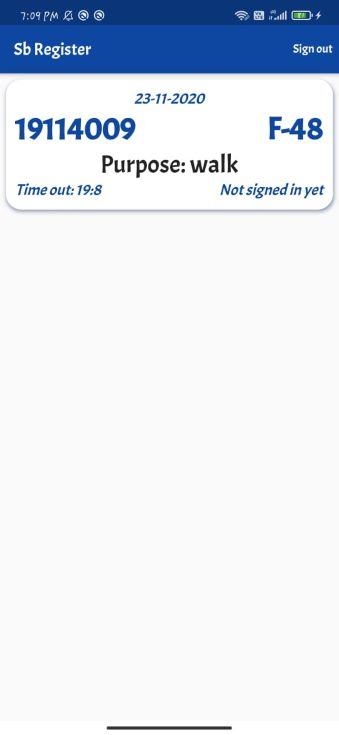

# Entry Register

An application made in Flutter for students residing in hostels. Tired of writing entries in hostel entry register everytime you need to go out of the hostel? So here comes the use of this app. It eases this process of managing entries for both the residents and the administration of the hostel by allowing the residents to create entry when they go out in an easy manner and by allowing the administration of the hostel to view all the entries created and find out the details of who went where and when.

## Description

The flow of the app is as follows: 

1. Register the place

-First of all the administration of a hostel needs to register their hostel in the app by setting a PIN which is only known by the administration. 

2. Resident side

-After that the residents need to create their account on the app corresponding to their hostel.
-After the resident is logged-in in the app, he can create entry when he goes out by just typing the purpose.
-When he returns to the hostel he needs to check in and the time will be saved.

3. Admin side
-Admin of the hostel can sign in by entering the PIN and view all the entries created in the register of that hostel by its residents.

